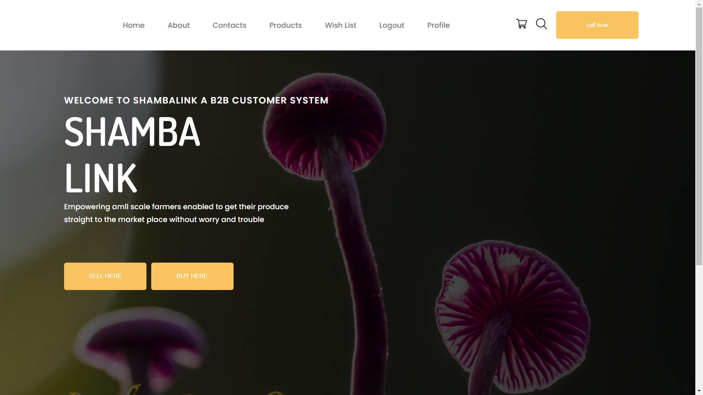

# Shamba Link - An e-commerce application solely made fore the selling of mushrooms

This is a solution I built as part of my second year project to help mushroom growing farmers sell their mushrooms.

## Table of contents

- [Overview](#overview)
  - [Screenshot](#screenshot)
  - [Links](#links)
- [My process](#my-process)
  - [Built with](#built-with)
  - [What I learned](#what-i-learned)
  - [Continued development](#continued-development)
  - [Useful resources](#useful-resources)
- [Author](#author)
- [Acknowledgments](#acknowledgments)

## Overview

So the grater application is just a simple e-commerce system to help muhroom farmers get their mushrooms online easily.

### **Objective**

Design and develop a platform to buy and sell mushrooms to the general public

### **Key Features to Implement**
- **Homepage**: User-friendly showcase of featured listings with filters (price, location, type).
- **User Registration**: Secure registration with email, phone or social media verification.
- **Mushroom Listings**: Create detailed listings with photos, specifications, history, and price.
- **Search & Filters**: Enable filtering by type, price, and location.
- **Messaging System**: Facilitate direct communication between buyers and sellers.
- **Seller Dashboard**: Track listing performance, inquiries, and sales.
- **Admin Panel**: Manage listings, approve content, and ensure platform quality.

### **Add-On Features**
- **Dealer Listings**: Highlight mushroom and agroproduct suppliers.
- **Certified Mushroom Sellers**: Connect tractor owners with trained operators.

---

### Screenshot

### Links

- Solution URL: [Shamba Link](https://agriculture-app-1d71.onrender.com)
- Live Site URL: [shamba Link](https://agriculture-app-1d71.onrender.com)

## My process

### Built with

- Semantic HTML5 markup
- CSS custom properties
- Flexbox
- CSS Grid
- Desktop-first workflow
- MongoDB - NoSql database
- Express JS

### What I learned

I learnt that sending raw multipart forms is not easy at all

### Continued development

- Finish Up adding all the features that are listed
- Enhance the project structure of the folder for clarity of others and myself.

### Useful resources

- [Express Session](https://www.npmjs.com/package/express-session) - This helped me set up the express session.
- [Express](https://www.npmjs.com/package/express) - This is teh http server that helped me setup http.

## Author

- Website - [Andrew Kimani](https://www.andrewkimani.tech/)
- Twitter - [@andrew_kim2003](https://x.com/andrew_kim2003)

